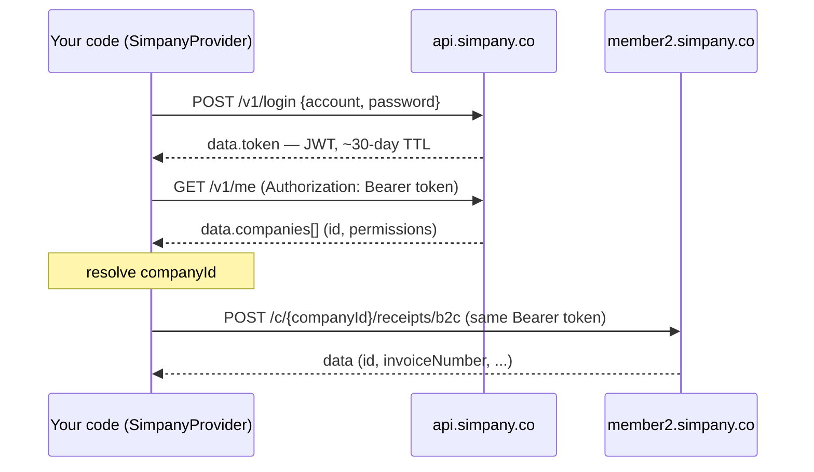

# @paid-tw/einvoice-simpany

Simpany ([simpany.co](https://simpany.co/e-invoice)) adapter for
[@paid-tw/einvoice](../einvoice).

> ⚠️ **The WRITE payloads (issue / void / allowance / void-allowance) were compiled
> by hand, may be inaccurate, and have never been executed.** The auth layer
> (login / `me` / company resolution) is verified against production, and the READ
> path — detail / list / track-number / subscription routes, required query params,
> response fields and enum values — has been verified read-only by the community
> against a live e-invoice-enabled production account (2026-08, see
> [PR #5](https://github.com/paid-tw/einvoice/pull/5) — thanks @reidevbx). Treat
> the write operations as a best-effort starting point and file GitHub issues for
> any discrepancy. The package is `private: true` and is not published until verified.
>
> Before using it, **please read the [Disclaimer](#disclaimer)** and confirm your
> usage complies with applicable regulations and Simpany's terms of service.

> Legend: ✅ = checked against the live API (VERIFIED); ⚠️ = hand-compiled, not yet
> tested (UNVERIFIED).

## Architecture & how it works

- This package implements core's `InvoiceProvider` contract (`@paid-tw/einvoice`).
  Application code depends only on that interface, so switching providers is just a
  different constructor (`createSimpanyProvider(...)`) — nothing else changes.
- Simpany publishes no developer API; the shape below was compiled by hand and may
  be inaccurate.
- **Two hosts, one JWT:**
  - Auth/account: `https://api.simpany.co/v1` (`POST /login`, `GET /me`) — ✅ verified
  - E-invoice (internally "receipt"): `https://member2.simpany.co/api/v1/c/{companyId}/…`
    — ✅ read path verified; ⚠️ write payloads unverified
- **Request flow** (issue as the example):
  1. lazily log in for a JWT (or use an injected `token`)
  2. resolve `companyId` (from config, or `GET /me`)
  3. call the receipt host `POST /c/{companyId}/receipts/{b2b|b2c}` with `Authorization: Bearer <token>`



## Authentication

- **Credentials → token:** `POST https://api.simpany.co/v1/login` with body
  `{ account, password }` (`account` is the member's email) → `{ status:"ok", data:{ id, token } }`.
- **The token is a JWT bearer**, lifetime ~**30 days** (`exp − iat = 2,592,000`s). Every
  subsequent request carries the header `Authorization: Bearer <token>`.
- **One token authorizes both hosts** (cross-checked): the auth host and the receipt host share it.
- **Client behaviour:** lazy login (only on the first call) → token cached → on a `401`,
  re-login once and retry (requires a `password` in config).
- **Inject a token directly:** set `token` to skip the credential login (e.g. from a vault);
  `account` / `password` are then optional.
- Login has **no captcha / CSRF / MFA**; credentials go to `/login` over TLS only.
- ⚠️ **Security:** the token is a 30-day long-lived credential — keep it server-side, never in
  the frontend or version control; manage both credentials and token as env vars / secrets.
  Trace logs **never record request/response bodies** (see "Errors & debugging").

**Obtain a token / check permissions with curl:**

```bash
# 1) exchange credentials for a token
curl -s https://api.simpany.co/v1/login \
  -H 'content-type: application/json' \
  -d '{"account":"user@example.com","password":"••••••"}'
# → {"status":"ok","code":200,"data":{"id":5129,"token":"<JWT>"}}

# 2) use the token to list the account's companies (check for e_receipt)
curl -s https://api.simpany.co/v1/me -H 'authorization: Bearer <JWT>'
```

**`GET /v1/me` response example** (typed in code as the exported `SimpanyMe` /
`SimpanyCompany` in `client.ts`; placeholder data below):

```jsonc
{
  "status": "ok",
  "code": 200,
  "data": {
    "id": 5129,
    "name": "Ming Wang",
    "email": "user@example.com",
    "companies": [
      {
        "id": 3432,                       // ← this is the companyId
        "name": "Example Co., Ltd.",
        "service_type": "REGISTRATION_BOOKKEEPING",
        "operating_status": "OPERATING",
        "permissions": ["account_book", "e_receipt"]  // ← needs e_receipt to issue
      }
    ]
  }
}
```

## Operations & endpoints (routes verified; write payloads still hand-compiled, UNVERIFIED)

| Unified op | HTTP | Endpoint (under the receipt base) |
|---|---|---|
| `issue` | POST | `/c/{cid}/receipts/{b2b\|b2c}` |
| `void` | DELETE | `/c/{cid}/receipts/{receiptId}`, body `{reason, emails}` |
| `allowance` | POST | `/c/{cid}/receipts/{receiptId}/draft-allowances`, body `{emails, items:[{id,quantity,price}]}` |
| `voidAllowance` | DELETE | `/c/{cid}/allowances/{id}` (or `/draft-allowances/{id}`) |
| `query` | GET | `/c/{cid}/receipts/{receiptId}` |

- **Internal id vs invoice number:** void / query / allowance key off Simpany's
  INTERNAL receipt id, not the 發票號碼. Pass an `issue` result's `raw.id` (or a
  `listReceipts()` row id) via `providerOptions.receiptId` — **required**; without
  it the call throws `VALIDATION` before any request. The old invoice-number
  lookup was removed: the list endpoint requires `status` / `startDate` /
  `endDate` (verified live — the lookup could only ever 422) and its `keyword`
  filter is unverified.
- **voidAllowance** requires `providerOptions.allowanceId` (internal id); add
  `providerOptions.draft: true` when the allowance is still a DRAFT (待確認).
- **Capabilities:** ISSUE / VOID / ALLOWANCE / VOID_ALLOWANCE / QUERY / B2B.
  NOT supported: MIXED_TAX (tax type is invoice-level), FOREIGN_CURRENCY,
  CARRIER_VALIDATION (no such endpoint in the client).

## Extension methods (beyond the `InvoiceProvider` interface)

Alongside the five unified operations, the adapter offers these Simpany-specific
methods (mirroring ezreceipt's extension convention). The **read-only** ones mutate
nothing — handy for verifying the integration, reconciliation, and pre-issue checks:

| Method | Endpoint | Purpose | Mutates? |
|---|---|---|---|
| `listReceipts(query?)` | GET `/receipts` | list issued invoices; the API-required `status`+`startDate`+`endDate` default to `ALL` + the **~12 months ending today** (hard 12-month cap, below), **paging through the window** (below) | read-only |
| `simpanyListWindows(from, to)` | (pure function) | split a longer period into windows the API accepts (below) | no request |
| `canIssue(n?)` | GET (both of the above) | **pre-issue capacity check**: both quota limits at once, naming the bottleneck (below) | read-only |
| `listTrackNumbers({year?, enabledOnly?})` | GET `/track-numbers?year=ROC` | **track numbers**: total / used / remaining per range (below; `year` is a **ROC (民國) year**, default current) | read-only |
| `getSubscriptionStatus()` | GET `/subscription-status` | **plan quota**: `{ status, remainingQuantity }` (below) | read-only |
| `listFrequentItems()` | GET `/frequent-items` | **frequent items** (reusable name/price presets) | read-only |
| `notifyReceipt(receiptId, emails)` | POST `/receipts/{id}/notifications` | resend / send the notification to given emails | sends email |
| `printReceipt(receiptId, {format?, reprint?})` | POST `/receipts/{id}/print` | download the proof-copy PDF (bytes) | read-only |

### Subscription quota

Simpany is **subscription-based**: each plan has a quota of issuable invoices.
`getSubscriptionStatus()` returns `{ status, remainingQuantity, raw }` — `remainingQuantity`
is the **remaining issue count**, useful as a pre-issue check. ⚠️ This is a **different
"remaining" from track numbers**:

- **Track-number remaining** (`listTrackNumbers()`): how many **invoice numbers** are left in
  the government-allocated ranges.
- **Subscription remaining** (`getSubscriptionStatus()`): how many issues are left in the
  **Simpany plan** you purchased.

Both must be sufficient to issue: out of numbers → allocate/split a track; out of quota → buy more.

**`canIssue(n)` asks both at once** so callers don't have to reconcile two endpoints:

```ts
const cap = await provider.canIssue(10);
if (!cap.ok) {
  // bottleneck: "SUBSCRIPTION" (buy more quota) or "TRACK_NUMBER" (allocate/split a track)
  throw new Error(`cannot issue 10 yet — bottleneck: ${cap.bottleneck}`);
}
// cap.subscriptionRemaining / cap.trackRemaining / cap.tracks (per-track breakdown)
```

On a subscription plan the paid quota is often **far smaller** than the remaining
invoice numbers, so checking only the tracks reads as optimistic.

⚠️ **Counts `ENABLED` tracks only** — not just tidiness. A track's status is
`ENABLED` / `EXPIRED` (a different enum from a receipt's status), and an **expired
track keeps its `remainingQuantity`**: a lapsed period was observed still reporting
all 200 numbers unused. Including them overstates capacity by whole periods.

⚠️ `trackRemaining` is still an **upper bound**: the verified account had only the
current period enabled, but that is one account at one moment and does not rule out
a future 期別 being enabled early — inspect `cap.tracks[].year` / `.month` when that
matters.

### The invoice list's date range: a hard 12-month cap

**API limit:** `endDate − startDate` may span at most **12 months** (verified: exactly
12 months is accepted, one day more is a 422 naming both bounds). The server states the
rule as `startDate >= endDate − 12 months`. The cap is exported as `LIST_MAX_SPAN_MONTHS`.

**Default:** without dates, `listReceipts()` queries the **~12 months ending at
`endDate`** (which itself defaults to today in Asia/Taipei) rather than the calendar
year. A year-to-date window has a blind spot every January — on 5 January it is five
days wide and cannot see December's invoices, so a pre-issue duplicate check that reads
"nothing found" issues a second invoice for an order already invoiced, which once the
period has closed can only be undone with an allowance. The default deliberately stops
**one day short of the cap** so leap-day month arithmetic cannot push it over.

Supplying one end works too: `{ endDate: "2024-06-30" }` reads the year up to that date,
not a backwards range starting today.

**A range longer than the cap is rejected before the request** (a `VALIDATION` error
rather than a wasted 422), including one that only becomes too long once the other end
is defaulted. To read further back, split it with `simpanyListWindows()` — the endpoint
cannot express a longer range, so this is the supported way:

```ts
import { simpanyListWindows } from "@paid-tw/einvoice-simpany";

const rows = [];
for (const w of simpanyListWindows("2023-01-01", "2026-08-07")) {
  rows.push(...(await provider.listReceipts(w)));
}
```

The windows are contiguous, non-overlapping, and cover the range exactly, and each one
is guaranteed to pass the API's span check — month arithmetic does not round-trip across
short months (1 March plus two months less a day is 30 April, yet 30 April minus two
months overflows to 2 March), so the splitter gives back a day at a time until each
window is legal.

### Pagination: the whole window by default, because truncation is silent

⚠️ **The list response is a bare array with no pagination metadata** — no `total`, no
`lastPage`, no `meta`. A caller handed one page has no way to tell it is holding a
partial answer. This is the same hazard as the Gregorian year: **200 with incomplete
data is more dangerous than a 422**, and the failure path is just as expensive —

> 300 invoices in the window, server page size 50 → the duplicate check scans only the
> first 50 → the order looks uninvoiced → a second invoice goes out → once the period
> has closed, only an allowance can undo it.

So `listReceipts()` **pages through the window by default**. Two ways out, each a single
request:

| Call | Behaviour |
|---|---|
| `listReceipts()` | pages until the window is exhausted |
| `listReceipts({ page: 2 })` | that page only — you drive pagination |
| `listReceipts({ limit: 5 })` | 5 rows — `limit` caps the rows, it does not page in fives |

The loop ends on an **empty page**, not on "fewer rows than the limit I asked for": the
server may cap `limit` below the request, and stopping at a short page would drop
everything past that cap — the very truncation the loop exists to prevent. A runaway
guard **throws** rather than quietly returning a prefix.

> The allowances list is presumed to behave the same way, untested for want of allowance
> data; no provider method wraps it yet.

### Frequent items

The back office maintains "frequent items" — reusable name/price presets picked at issue time.
`listFrequentItems()` reads the list (hand-compiled fields, roughly `{ id, name, price }`). The
adapter exposes read-only access; create/update/delete endpoints are registered in
`SIMPANY_RECEIPT_ENDPOINTS` (`frequentItems` / `frequentItem`) and can be wired as methods if needed.

## Issue fields & required rules

`POST /c/{cid}/receipts/{b2b|b2c}`. Required/format below come from the issue
form's client-side validation (**server contract unverified**); the adapter runs
the same checks locally before sending (disable with `validatePayload: false`).

| wire field | required | rule / values | unified |
|---|---|---|---|
| `customId` | optional | any string | `orderId` |
| `customer.vat` | B2B only | 8 digits | `buyer.ubn` |
| `customer.name` | B2B only | ≤255 | `buyer.name` |
| `customer.address` | optional | — | `buyer.address` |
| `customer.emails` | **required** | email (multiple allowed) | `buyer.email` |
| `taxType` | required | `TAXABLE` / `ZERO_TAX_RATE` / `EXEMPTION` | `taxType` |
| `isTaxIncluded` | required | boolean | `priceMode` |
| `items[].name` | required | ≤255 | `item.description` |
| `items[].quantity` | required | 1–999999 | `item.quantity` |
| `items[].price` | required | 0–99999999 | `item.unitPrice` |
| `items[].subTotal` | required | = quantity × price | `item.amount` |
| `carrier.type` | B2C | `NO_CARRIER`/`MOBILE_BARCODE`/`CITIZEN_DIGITAL_CERTIFICATE`/`MEMBERSHIP` | `carrier.type` |
| `carrier.number` | per type | mobile `/`+7 chars; citizen-cert 16 chars (2 letters + 14 digits) | `carrier.code` |
| `npoBan` | B2C + donate | 3–7 digits | `donation.npoban` |
| `zeroTaxRateReasonCode` | zero-rate | code (see `zero-tax-rate-reasons`) | `providerOptions` |
| `customsClearanceType` | zero-rate | `NOT_VIA_CUSTOMS` / `VIA_CUSTOMS` | `providerOptions` |
| `remark` | optional | — | `remark` |
| `shouldAdjustTaxAmount` | optional | boolean (B2B ±1) | `providerOptions` |

> Note: the form offers no issue-date field (the server issues at "now"), so the
> unified `date` has no effect on Simpany.

### Money semantics

- Simpany **computes tax and tax-inclusive/exclusive amounts server-side**: you send
  `items` (unit `price` × quantity) and `isTaxIncluded` (from the unified `priceMode`:
  `TAX_INCLUSIVE` / `TAX_EXCLUSIVE`); the server derives the statutory amounts.
- The unified `amount` (`salesAmount` / `taxAmount` / `totalAmount`, **integer TWD**) is
  used by this adapter mainly for input validation and to fill the result — it is not sent
  field-by-field (the server is authoritative, from `items`).
- Statutory amounts are integer TWD; this adapter does **not** support foreign currency
  (no `FOREIGN_CURRENCY`).

## Usage

```ts
import { createSimpanyProvider } from "@paid-tw/einvoice-simpany";

const provider = createSimpanyProvider({
  account: process.env.SIMPANY_ACCOUNT!,
  password: process.env.SIMPANY_PASSWORD!,
  // companyId: 3432, // else resolved from /me (sole company, or by companyUbn)
});

const inv = await provider.issue({
  orderId: "ORD-1",
  buyer: { name: "買受人", email: "buyer@example.com" },
  items: [{ description: "商品A", quantity: 2, unitPrice: 50, amount: 100 }],
  amount: { salesAmount: 100, taxAmount: 5, totalAmount: 105 },
  taxType: "TAXABLE",
  priceMode: "TAX_EXCLUSIVE",
});

// pass raw.id back as receiptId (REQUIRED — Simpany keys off its internal id;
// there is no invoice-number reverse lookup)
const receiptId = (inv.raw as { id: number }).id;
await provider.query({ invoiceNumber: inv.invoiceNumber, providerOptions: { receiptId } });
await provider.void({ invoiceNumber: inv.invoiceNumber, reason: "wrong", providerOptions: { receiptId } });
```

### Void or allowance? Read the `can*` flags

Cancelling an invoice is a **void** within the current period but only an **allowance**
once the period has closed. The detail response answers this directly —
`canInvalidate` / `canIssueAllowance` (and `canPrint`) are all in `query()`'s `raw`:

```ts
const q = await provider.query({ invoiceNumber, providerOptions: { receiptId } });
const { canInvalidate, canIssueAllowance } = q.raw as {
  canInvalidate: boolean;
  canIssueAllowance: boolean;
};

if (canInvalidate) {
  await provider.void({ invoiceNumber, reason: "wrong", providerOptions: { receiptId } });
} else if (canIssueAllowance) {
  await provider.allowance({ ... });
}
```

**More reliable than computing the period caller-side**: period rules, MOF upload state
and whether the invoice was already credited are all settled server-side (verified: a
cross-period invoice reports `canInvalidate: false`, a current-period one `true`).
`raw` also carries `uploadStatus` (MOF upload state) and `remainingAmount` (the balance
left after allowances).

`providerOptions` fields: `receiptId` (**required for void/query/allowance**), `allowanceId`, `draft`, `emails` (notice
recipients), `zeroTaxRateReasonCode` / `customsClearanceType` (zero-rate),
`shouldAdjustTaxAmount` (B2B ±1 rounding), `items` (raw allowance lines
`[{id,quantity,price}]`).

## Configuration (SimpanyConfig)

| field | required | notes |
|---|---|---|
| `account` | one of | login account (member email). One of `account`+`password` or `token` |
| `password` | one of | login password (TLS only). Needed for auto re-login on a 401 |
| `token` | one of | a pre-obtained JWT, to skip the credential login |
| `companyId` | optional | scope requests to this company; else resolved via `GET /me` |
| `companyUbn` | optional | pick a company by 統編 when several exist |
| `validatePayload` | optional | default `true`; local pre-flight validation (set `false` to skip) |
| `timeoutMs` | optional | per-request timeout (ms) |
| `baseUrl` | optional | override the auth host base (default `https://api.simpany.co/v1`) |
| `receiptBaseUrl` | optional | override the receipt host base (default `https://member2.simpany.co/api/v1`) |
| `debug` | optional | trace callback (metadata-only, see below) |
| `fetch` | optional | inject a custom `fetch` (testing / edge runtime) |

## Errors & debugging

- **Every failure throws core's `InvoiceError`** (never a raw error), carrying:
  - `code`: `AUTH` / `VALIDATION` / `NOT_FOUND` / `CONFLICT` / `NETWORK` / `PROVIDER` / `UNSUPPORTED` / `UNKNOWN`
  - `rawCode`, `rawMessage`, `raw` (the original response, for debugging)
  - Narrow with `isInvoiceError(e)`, **not `instanceof`** (which breaks across ESM/CJS or version skew).
- **Mapping:** HTTP `401`/`403`→`AUTH`, `404`→`NOT_FOUND`, `409`→`CONFLICT`, `400`/`422`→`VALIDATION`,
  `429` and `5xx`→`PROVIDER`; transport failure→`NETWORK`. Both member2 error shapes (framework
  `{message}` / `{errors}` and business `{status:"error",error:{title}}`) are normalized.
- **Tracing:** set `debug` to receive per-request metadata (`provider` / `method` / `url` / `status` /
  `durationMs` / `error`); request/response **bodies are never logged** (possible PII / encrypted
  content). To capture bodies, wrap your own `fetch` and pass it as `config.fetch`.

## Cross-checked (read-only, with our own account — no invoice was issued)

- ✅ Auth and e-invoice **share one JWT**: a token from `api.simpany.co` reaches the
  application layer on `member2.simpany.co` (not blocked at 401).
- ✅ The base URL and `/c/{companyId}/receipts…` route structure are correct (routes matched).
- ✅ The error envelope is framework-style `{ message }` (with `{ errors }` when relevant);
  a company not enrolled for e-invoice gets a **404** on these routes (normalized to `NOT_FOUND`).

### Community-verified read-only against a live e-invoice-enabled account (2026-08, [PR #5](https://github.com/paid-tw/einvoice/pull/5) — thanks @reidevbx)

- ✅ **Detail** `GET /c/{cid}/receipts/{id}` response fields and enum values match the
  adapter's assumptions (`taxType: "TAXABLE"`, `carrierType: "NO_CARRIER"`,
  `status: "ISSUED"`, …). Highlights:
  - `issuedAt` is ISO8601 with an offset (`YYYY-MM-DDTHH:MM:SS+08:00`);
  - amounts are `untaxedAmount` / `taxAmount` / `totalAmount` (plus post-allowance
    `remainingAmount`);
  - `randomNumber` is `null` on B2B (whether B2C carries one is still open);
  - `items[]` is `{ id, name, quantity, price, amount, amountWithTax }` — `id` is a
    **string** (the line id allowances need);
  - `canInvalidate` / `canIssueAllowance` / `canPrint` (whether the invoice can still
    be voided / credited / printed — a cross-period invoice showed `canInvalidate:
    false`) and `uploadStatus` (MOF upload state) are all in `query()`'s `raw`.
- ✅ **List** `GET /receipts`: `status` + `startDate` + `endDate` are **all required**
  (anything less is a 422); `status=ALL` and `page` / `limit` work; `yearMonth` is
  **not accepted**. The **allowances list** requires `status` too. There is also a
  **12-month cap on the window**: exactly 12 months passes, one day more is a 422
  naming both bounds (the rule is `startDate >= endDate − 12 months`).
- ✅ **Track status** is `ENABLED` / `EXPIRED` (a different enum from a receipt's
  status), and an **expired track keeps its `remainingQuantity`** (a lapsed period was
  observed still reporting 200 numbers unused) — capacity arithmetic must count
  `ENABLED` tracks only.
- ✅ **List pagination**: `page` / `limit` work (`limit` accepts at least 1000), but the
  response is a **bare array with no pagination metadata**, so anything past the page
  size is truncated silently and undetectably.
- ✅ **`simpanyListWindows()` output was replayed against the server**: `2023-01-01 …
  2026-08-07` split into 4 windows, contiguous and covering the range exactly, and all
  four were accepted — confirming the adapter's span predicate matches the server's rule
  rather than merely being self-consistent.
- ✅ **Tracks** `GET /track-numbers`: requires `year` as a **ROC (民國) year** (e.g. 115);
  a Gregorian year is **not an error — it returns an empty list**;
  `/track-numbers/enabled` takes no `year`. Actual fields: `{ id, year, month, type,
  track, beginNumber, endNumber, lastUsedNumber, remainingQuantity, status, can* }`
  (`remainingQuantity` is the API's own authoritative remaining count).
- ✅ `GET /subscription-status` → `{ status, remainingQuantity }`, matching
  `getSubscriptionStatus()`; `GET /receipts/zero-tax-rate-reasons` → 9 rows of
  `{ code, name }`; `GET /frequent-items` works.

## Getting an e-invoice-enabled account

The receipt endpoints require the company to have Simpany's **e-invoice
(value-added center) service enabled**. When it isn't:

- `GET /v1/me` `permissions` will **not** include `e_receipt`;
- every `/c/{companyId}/receipts…` call returns **404** (adapter → `NOT_FOUND`).

Apply for / enable it via Simpany's e-invoice service
([simpany.co/e-invoice](https://simpany.co/e-invoice)). Once enabled, the same
account credentials work — no separate account is needed.

## Verifying the integration (read-only, issues nothing)

With an e-invoice-enabled account, these **read-only** calls confirm the whole chain
(auth → company → permission → routing → response parsing) is wired — **without
creating any invoice**:

```ts
const provider = createSimpanyProvider({ account, password });

// 1) account / company / permissions (should include e_receipt)
const me = await provider.me();
console.log(me.companies.map((c) => ({ id: c.id, permissions: c.permissions })));

// 2) track numbers: total / used / remaining (year is a ROC year, default current —
//    a Gregorian year throws VALIDATION)
const tracks = await provider.listTrackNumbers();
console.table(
  tracks.map((t) => ({
    year: t.year, // ROC year, e.g. 115
    month: t.month,
    track: t.track, // e.g. "AB"
    total: t.total,
    used: t.used,
    remaining: t.remaining, // straight from the API's remainingQuantity
  })),
);

// 3) list issued invoices (confirms read access; `limit` caps the rows — one request)
const receipts = await provider.listReceipts({ limit: 5 });
console.log(`read ${receipts.length} invoices`);

// 4) capacity check: plan quota + track numbers at once, with the bottleneck named
const cap = await provider.canIssue(1);
console.log(
  `can issue: ${cap.ok}; plan ${cap.subscriptionRemaining} left, ` +
    `${cap.trackRemaining} numbers left${cap.bottleneck ? ` (bottleneck: ${cap.bottleneck})` : ""}`,
);

// (optional) reusable line-item presets
const items = await provider.listFrequentItems();
```

> **Two different "remaining":** `listTrackNumbers()` is the **invoice-number** ranges
> (government-allocated 字軌); `getSubscriptionStatus().remainingQuantity` is the **Simpany
> plan** quota (how many issues you've paid for).

- `me()` / `listTrackNumbers()` / `listReceipts()` / `canIssue()` are adapter **extensions** (beyond the
  `InvoiceProvider` interface), for reading/verification only — they mutate nothing.
- If the account **isn't enrolled** for e-invoice, these return 404 (→ `NOT_FOUND`) — a
  permission/enrollment issue, not a wiring bug.
- `listTrackNumbers({ year })`'s `year` is a **ROC (民國) year** (e.g. 115), defaulting to
  the current Taipei year; a Gregorian year throws `VALIDATION` — the API responds to one
  with **200 + an empty list, not an error** (verified live), and a silent empty result
  would read as "tracks exhausted".
- `remaining` comes straight from the API's `remainingQuantity` (authoritative); `total`
  is derived from the range (`endNumber − beginNumber + 1`) and `used = total − remaining`;
  each row also carries the original `raw`. **If the numbers look wrong, open an issue
  with the `raw`.**

## Resend a notification / download the invoice PDF

When a consumer mistyped their email at checkout and didn't get the invoice, you can
**resend it to a corrected address**, or **download the proof PDF** to send/print yourself:

```ts
// resend (to a corrected email; multiple allowed) — keyed by the internal
// receiptId (an issue result's raw.id)
await provider.notifyReceipt(receiptId, ["fixed@example.com"]);

// download the invoice proof PDF (returns bytes)
const { contentType, data } = await provider.printReceipt(receiptId, { format: "FORMAT_A4" });
```

- Both are adapter **extensions** (not in the `InvoiceProvider` interface; mirroring
  ezreceipt's `notifyInvoice` / `printInvoice`).
- Simpany also has a **login-free consumer view page**,
  `https://member2.simpany.co/consumer/receipts/{ref}/{token}` — `ref` is a timestamp
  (`R + YYMMDD + HHMMSS + seq`) and `token` is a per-invoice capability secret.
  ⚠️ **This link means "anyone with the link can see that invoice's personal data" — treat
  it as a secret: never log it or place it on an indexable page** (such links have been
  observed indexed by search engines). Whether the issue/detail response exposes this token
  is to be confirmed with an enabled account.

## Verification checklist — needs an e-invoice-enabled account (open an issue on mismatch)

1. **Issue payload** field names / required fields (esp. `customer`, `carrier`,
   `zeroTaxRateReasonCode`). ⚠️ Judging by the detail-response shape, four spots **may**
   not line up (the response is flat `buyerVat` / `buyerName`… vs our nested `customer`;
   `items[].amount` vs our `subTotal`; `items[].id` vs our `uuid`; non-zero-rate
   `customsClearanceType` reads `"BLANK"` while we send `null`) — but request and
   response shapes legitimately differ, so this is **not conclusive**; to be settled by
   recording an actual `POST /receipts/b2b` request from the web frontend.
2. **Issue / allowance immediate RESPONSE** fields (the detail-query response is verified,
   see above; the issue-time response and `allowanceNumber` remain open).
3. Success envelope (assumed `{data}`) and the issue business-error shape (assumed `{status:"error",error:{title}}`).
4. Allowance confirmation flow (created as DRAFT — does it need a separate confirm step?).
5. Whether B2C invoices carry a `randomNumber` (B2B verified `null`).

> The old item 3 ("the list query param for resolving a receiptId from an invoice
> number") no longer applies — the lookup was removed and `providerOptions.receiptId`
> is now required (see the PR #5 discussion).

## Tests

```bash
pnpm --filter @paid-tw/einvoice-simpany exec vitest run

# Live (auth layer only, against production):
SIMPANY_LIVE=1 SIMPANY_ACCOUNT=… SIMPANY_PASSWORD=… \
  pnpm exec vitest run packages/einvoice-simpany/src/__tests__/live
```

## Contributing

The e-invoice operations are hand-compiled and untested against the live API — the
most valuable contribution is to **verify them with an e-invoice-enabled account and
report back**.

- **Report a discrepancy (open an issue)** — work through the verification checklist
  above and include (⚠️ **redact tokens / emails / 統編 / buyer info first**):
  1. the operation (`issue` / `void` / `allowance` / …) and the unified input you passed;
  2. the request the adapter actually sent (endpoint + body) and Simpany's response;
  3. expected vs actual result.
- **Submit a fix (PR)** — once you've confirmed an item, please also:
  1. update the relevant `endpoints.ts` / `provider.ts` / `mapping.ts`;
  2. move the item from the verification checklist to "cross-checked" and drop the
     matching UNVERIFIED / "hand-compiled" wording;
  3. update or add MSW tests (`src/__tests__/`) using the real (redacted) shapes so the
     tests reflect reality;
  4. run the full gate before pushing:
     `pnpm build && pnpm typecheck && pnpm lint && pnpm format:check && pnpm test`.
- **Live tests** — `src/__tests__/live.test.ts` currently covers only the auth layer
  (`SIMPANY_LIVE=1`). Live issue/void/allowance tests are welcome — note they create
  **real invoices**, so use a test-mode / test account.
- Once verified and stable, drop `private: true` from `package.json` to publish.

## Disclaimer

This adapter is provided as-is. Before using it, make sure your usage complies
with all applicable laws, tax/e-invoice regulations, and Simpany's terms of
service. You are responsible for confirming that programmatic access is
permitted for your account and use case.
