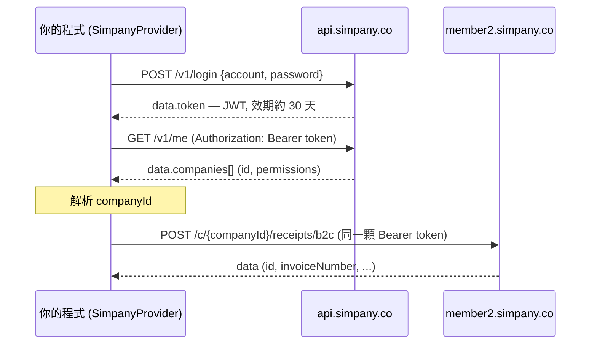

# @paid-tw/einvoice-simpany

Simpany（[simpany.co](https://simpany.co/e-invoice)）的 [@paid-tw/einvoice](../einvoice) 供應商轉接器。

> ⚠️ **「寫入」操作(開立、作廢、折讓、折讓作廢)送出的 payload 由我們人工梳理整理,
> 可能有誤,尚未實際執行過。** 登入 / `me` / 公司解析已對過正式 API(VERIFIED);
> **讀取路徑**(明細 / 列表 / 字軌 / 訂閱額度的路由、必填參數、回應欄位與 enum 值)
> 也已由社群以「已開通電子發票」的正式帳號唯讀驗證(2026-08,見
> [PR #5](https://github.com/paid-tw/einvoice/pull/5),感謝 @reidevbx)。
> 請把寫入操作當成 best-effort 起點使用,遇到不符就發 GitHub issue。本套件標記
> `private: true`,驗證通過前不會發佈到 npm。
>
> 使用前**請務必詳閱下方[免責聲明](#免責聲明)**,並自行確認符合相關法規與 Simpany 服務條款。

> 圖例:✅ = 已對過正式 API(VERIFIED);⚠️ = 人工整理、尚未實測(UNVERIFIED)。

## 架構與運作機制

- 本套件實作 core 的 `InvoiceProvider` 契約(`@paid-tw/einvoice`)。應用端只依賴該介面,
  換供應商就只換 constructor(`createSimpanyProvider(...)`),其餘程式不動。
- Simpany 沒有公開的開發者 API;以下形狀為人工整理(可能有誤)。
- **雙 host、同一顆 JWT**:
  - 認證 / 帳號:`https://api.simpany.co/v1`(`POST /login`、`GET /me`)— ✅ 已驗證
  - 電子發票(內部稱 **receipt**):`https://member2.simpany.co/api/v1/c/{companyId}/…`
    — ✅ 讀取路徑已驗證;⚠️ 寫入 payload 待驗證
- **一次操作的資料流**(以開立為例):
  1. 惰性登入取得 JWT(或使用注入的 `token`)
  2. 解析 `companyId`(由 config 指定,或 `GET /me` 取得)
  3. 對 receipt host 打 `POST /c/{companyId}/receipts/{b2b|b2c}`,並帶 `Authorization: Bearer <token>`



## 身份驗證(Authentication)

- **帳密換 token**:`POST https://api.simpany.co/v1/login`,body `{ account, password }`
  (`account` 為 member 的 email)→ 回 `{ status:"ok", data:{ id, token } }`。
- **token 是 JWT bearer**,效期約 **30 天**(`exp − iat = 2,592,000` 秒)。之後每個請求都帶
  HTTP header `Authorization: Bearer <token>`。
- **同一顆 token 同時授權兩個 host**(已交叉驗證):認證 host 與發票 host 共用。
- **client 行為**:惰性登入(首次呼叫才登入)→ 快取 token → 遇 `401` 自動重新登入一次並重試
  (需 config 有 `password`)。
- **可直接注入 token**:設定 `token` 即可略過帳密登入(例如從 vault 取),此時可不帶
  `account` / `password`。
- 登入**無 captcha / CSRF / MFA**;帳密僅經 TLS 傳給 `/login`。
- ⚠️ **`/login` 有限流:實測約每分鐘 6 次**(回應帶 `X-RateLimit-Limit: 6`、`Retry-After` 秒數)。
  請**共用同一個 client 實例** — 每 new 一個 client 就會重新登入一次,所以「每個測試建一個」或
  「每個 request 建一個」很容易觸頂。token 效期有 30 天,重用完全足夠。
  超過時會 throw 一個訊息明確標示限流與等待秒數的 `InvoiceError`(`code: PROVIDER`,
  `raw.retryAfterSeconds`);另可用匯出的 `isThrottled(status)` / `retryAfterSeconds(headers)` 自行判斷。
  註:**429 的 body 是 HTML 而非 JSON envelope**,client 會在解析前先攔截 —— 否則會誤報成
  「非 JSON 回應」,看起來像端點壞掉而不是被限流。
- ⚠️ **安全**:token 等同一組效期 30 天的長期憑證——請只放在伺服器端,勿寫入前端或版控;
  帳密與 token 都應以環境變數 / secret 管理。追蹤日誌**不會記錄 request/response body**(見「錯誤處理與除錯」)。

**用 curl 手動取 token / 檢查權限:**

```bash
# 1) 帳密換 token
curl -s https://api.simpany.co/v1/login \
  -H 'content-type: application/json' \
  -d '{"account":"user@example.com","password":"••••••"}'
# → {"status":"ok","code":200,"data":{"id":5129,"token":"<JWT>"}}

# 2) 用 token 查帳號與名下公司(確認 permissions 是否含 e_receipt)
curl -s https://api.simpany.co/v1/me -H 'authorization: Bearer <JWT>'
```

**`GET /v1/me` 回應範例**(程式端對應 `client.ts` 匯出的 `SimpanyMe` / `SimpanyCompany` 型別;以下為示意假資料):

```jsonc
{
  "status": "ok",
  "code": 200,
  "data": {
    "id": 5129,
    "name": "王小明",
    "email": "user@example.com",
    "companies": [
      {
        "id": 3432,                       // ← 這就是 companyId
        "name": "範例股份有限公司",
        "service_type": "REGISTRATION_BOOKKEEPING",
        "operating_status": "OPERATING",
        "permissions": ["account_book", "e_receipt"]  // ← 需含 e_receipt 才能開發票
      }
    ]
  }
}
```

## 操作與端點（路由已驗證;寫入 payload 仍屬人工整理、UNVERIFIED）

| 統一操作 | HTTP | 端點（receipt base 之下） |
|---|---|---|
| 開立 `issue` | POST | `/c/{cid}/receipts/{b2b\|b2c}` |
| 作廢 `void` | DELETE | `/c/{cid}/receipts/{receiptId}`,body `{reason, emails}` |
| 折讓 `allowance` | POST | `/c/{cid}/receipts/{receiptId}/draft-allowances`,body `{emails, items:[{id,quantity,price}]}` |
| 折讓作廢 `voidAllowance` | DELETE | `/c/{cid}/allowances/{id}`(或 `/draft-allowances/{id}`) |
| 查詢 `query` | GET | `/c/{cid}/receipts/{receiptId}` |

- **內部 id vs 發票號碼**:作廢 / 查詢 / 折讓是用 Simpany 的**內部 receipt id**,不是發票號碼。
  請把 `issue` 結果的 `raw.id`(或 `listReceipts()` 列出的 row id)透過
  `providerOptions.receiptId` 傳入——**必填**,缺了會直接丟 `VALIDATION`(不發任何請求)。
  原本「以發票號碼反查」的 fallback 已移除:列表端點必填 `status` / `startDate` / `endDate`
  (缺了必回 422,已實測),反查請求根本到不了資料,且 `keyword` 過濾未經驗證。
- **折讓作廢**必須帶 `providerOptions.allowanceId`(內部 id);若折讓還在「待確認(DRAFT)」
  狀態,加 `providerOptions.draft: true` 走 draft 端點。
- **能力**:宣告 ISSUE / VOID / ALLOWANCE / VOID_ALLOWANCE / QUERY / B2B。**不支援**
  MIXED_TAX(稅別為發票層級)、FOREIGN_CURRENCY、CARRIER_VALIDATION(前端無此端點)。

## 擴充方法(非 `InvoiceProvider` 介面)

除了五個統一操作,adapter 另提供以下 Simpany 專屬方法(比照 ezreceipt 的擴充慣例)。**唯讀**方法
不會異動任何資料,很適合用來驗證串接、對帳、開立前檢查:

| 方法 | 端點 | 說明 | 異動? |
|---|---|---|---|
| `listReceipts(query?)` | GET `/receipts` | 發票列表;API 必填的 `status`+`startDate`+`endDate` 預設為 `ALL` + **往前約 12 個月**(有 12 個月硬上限,見下),並**自動翻頁取完**(見下) | 唯讀 |
| `simpanyListWindows(from, to)` | (純函式) | 把長區間切成 API 可接受的多段視窗(見下) | 不發請求 |
| `canIssue(n?)` | GET(上述兩支) | **開立前額度預檢**:一次檢查訂閱額度與字軌剩餘,回報哪一邊是瓶頸(見下) | 唯讀 |
| `listTrackNumbers({year?, enabledOnly?})` | GET `/track-numbers?year=民國年` | **字軌**:每段的總量 / 已開立 / 剩餘(見下;`year` 為**民國年**,預設當年) | 唯讀 |
| `getSubscriptionStatus()` | GET `/subscription-status` | **訂閱額度**:`{ status, remainingQuantity }`(見下) | 唯讀 |
| `listFrequentItems()` | GET `/frequent-items` | **常用品項**清單(可重複使用的品名/單價預設) | 唯讀 |
| `notifyReceipt(receiptId, emails)` | POST `/receipts/{id}/notifications` | 補寄 / 寄送通知信到指定 email | 寄送 email |
| `printReceipt(receiptId, {format?, reprint?})` | POST `/receipts/{id}/print` | 下載證明聯 PDF(回傳 bytes) | 唯讀 |

### 訂閱額度(subscription quota)

Simpany 採**訂閱制**:每個方案有可開立張數的額度。`getSubscriptionStatus()` 回
`{ status, remainingQuantity, raw }`——`remainingQuantity` 是**剩餘可開立張數**,可在開立前檢查
額度是否足夠。⚠️ 這與「字軌剩餘」是**兩種不同的剩餘**:

- **字軌剩餘**(`listTrackNumbers()`):財政部配號的**發票號碼範圍**還剩幾號可用。
- **訂閱剩餘**(`getSubscriptionStatus()`):你在 Simpany **買的方案額度**還剩幾張。

兩者都要足夠才開得出來:沒字軌號碼 → 取號 / 拆分字軌;沒訂閱額度 → 加購方案。

**`canIssue(n)` 幫你一次問完**——不必自己兜兩支 API:

```ts
const cap = await provider.canIssue(10);
if (!cap.ok) {
  // bottleneck: "SUBSCRIPTION"(加購方案)或 "TRACK_NUMBER"(取號 / 拆分字軌)
  throw new Error(`還開不了 10 張,瓶頸在 ${cap.bottleneck}`);
}
// cap.subscriptionRemaining / cap.trackRemaining / cap.tracks(各字軌明細)
```

訂閱制的方案額度**經常遠小於**字軌剩餘號碼,所以只看字軌會過度樂觀。

⚠️ **只計入 `ENABLED` 字軌**,這不只是整潔問題:字軌 status 有 `ENABLED` / `EXPIRED` 兩種
(與發票的 status 是不同列舉),而**過期字軌會保留 `remainingQuantity`**——實測有一段已過期
的字軌仍回報 200 號全數未用。把它們算進來會高估整整幾個期別的額度。

⚠️ `trackRemaining` 仍是**上限**:實測帳號當下只有當期字軌是 `ENABLED`,但這是單一帳號、
單一時間點的觀察,不足以排除未來期別被提前啟用的可能;必要時自行檢視 `cap.tracks[].year` / `.month`。

### 發票列表的時間範圍:12 個月硬上限

**API 限制**:`endDate − startDate` **最多 12 個月**(實測:整 12 個月可以,多一天就 422,
且錯誤訊息會同時報 `startDate` 與 `endDate` 兩個邊界)。伺服器的規則是
`startDate >= endDate − 12 個月`。這個上限以 `LIST_MAX_SPAN_MONTHS` 匯出。

**預設值**:不傳日期時查 **`endDate` 往前約 12 個月**(`endDate` 預設為台北時區的今天),
而不是「當年 1/1–12/31」。年度視窗在 1 月會有盲區——1 月 5 日執行時只涵蓋 5 天,查不到去年
12 月開的發票;「開立前查有沒有重複開過」若讀到空結果就會重複開立,而跨期的重複發票只能開折讓
收拾。預設視窗會**刻意距離上限一天**,避免閏日的月份運算把預設請求推過界。

只傳一邊也可以:`{ endDate: "2024-06-30" }` 會查該日往前一年,而不是從今天往回的倒序區間。

**超過 12 個月的區間會在送出前就被擋下**(丟 `VALIDATION`,不會浪費一次 422),包含
「只傳 `startDate`、另一邊套預設後才超長」的情況。要讀更久以前的資料,用
`simpanyListWindows()` 切成多段——API 沒有辦法表達更長的區間,這是唯一做法:

```ts
import { simpanyListWindows } from "@paid-tw/einvoice-simpany";

const rows = [];
for (const w of simpanyListWindows("2023-01-01", "2026-08-07")) {
  rows.push(...(await provider.listReceipts(w)));
}
```

切出來的視窗**連續、不重疊、剛好覆蓋**你要的區間,且每一段都保證通過 API 的跨度檢查
(月份運算在短月份不可逆——`3/1 + 2 個月 − 1 天 = 4/30`,但 `4/30 − 2 個月` 會溢位回 `3/2`——
切分器會逐日退讓直到合法)。

### 分頁:預設自動取完(因為截斷是安靜的)

⚠️ **列表回應是裸陣列,沒有任何分頁 metadata**——沒有 `total`、沒有 `lastPage`、沒有 `meta`。
所以拿到一頁的人**無從得知手上是不是只有一部分**。這跟西元年那個問題是同一類:
**200 + 不完整的資料,比 422 危險**,而且失效路徑一樣貴——

> 視窗內有 300 張、伺服器預設頁面大小 50 → 查重只掃到前 50 張 → 判定「沒開過」→ 重複開立 → 跨期只能開折讓。

因此 `listReceipts()` **預設會自動翻頁直到取完**。兩種退出方式,都只發一次請求:

| 呼叫 | 行為 |
|---|---|
| `listReceipts()` | 自動翻頁,取完整個視窗 |
| `listReceipts({ page: 2 })` | 只取第 2 頁(你自己控制分頁) |
| `listReceipts({ limit: 5 })` | 只取 5 筆——`limit` 是**筆數上限**,不是「每頁 5 筆一直翻」 |

終止條件是**回傳空頁**,而不是「回傳筆數 < 我要求的 limit」。因為伺服器可能把 `limit`
壓到比你要求的小,那時「短頁」並不代表結束,提早停就會漏掉上限之後的全部資料——正是這段
迴圈要防的同一種安靜截斷。另有失控保護:連續取滿上限頁數會**丟錯**,而不是安靜回傳前綴。

> `allowances` 列表推測有同樣行為,但目前沒有折讓資料可測;adapter 也還沒包成方法。

### 常用品項(frequent items)

後台可維護「常用品項」——重複使用的品名 / 單價預設,開立時挑選帶入。`listFrequentItems()`
讀取清單(欄位屬人工整理,約 `{ id, name, price }`)。目前 adapter 只提供讀取;新增 / 修改 /
刪除的端點已登錄於 `SIMPANY_RECEIPT_ENDPOINTS`(`frequentItems` / `frequentItem`),需要時可再包成方法。

## 開立欄位對照與必填規則

`POST /c/{cid}/receipts/{b2b|b2c}`(依買方有無統編決定 b2b/b2c)。下表的必填 / 格式來自
開立表單的前端驗證,**伺服器端合約尚未驗證**;adapter 會在送出前做同樣的本地檢查
(可用 `validatePayload: false` 關閉)。

| wire 欄位 | 中文 | 必填 | 規則 / 值 | unified 對應 |
|---|---|---|---|---|
| `customId` | 自訂單號 | 選填 | 任意字串 | `orderId` |
| `customer.vat` | 買方統編 | B2B 必填 | 8 碼 | `buyer.ubn` |
| `customer.name` | 買受人名稱 | B2B 必填 | ≤255 | `buyer.name` |
| `customer.address` | 買方地址 | 選填 | — | `buyer.address` |
| `customer.emails` | 通知信箱 | **必填** | email(可多組) | `buyer.email` |
| `taxType` | 課稅別 | 必填 | `TAXABLE` / `ZERO_TAX_RATE` / `EXEMPTION` | `taxType` |
| `isTaxIncluded` | 含稅價 | 必填 | boolean | `priceMode` |
| `items[].name` | 品名 | 必填 | ≤255 | `item.description` |
| `items[].quantity` | 數量 | 必填 | 1–999999 | `item.quantity` |
| `items[].price` | 單價 | 必填 | 0–99999999 | `item.unitPrice` |
| `items[].subTotal` | 小計 | 必填 | =數量×單價 | `item.amount` |
| `carrier.type` | 載具類別 | B2C 必填 | `NO_CARRIER`/`MOBILE_BARCODE`/`CITIZEN_DIGITAL_CERTIFICATE`/`MEMBERSHIP` | `carrier.type` |
| `carrier.number` | 載具號碼 | 視載具 | 手機條碼 `/`+7 碼;自然人憑證 16 碼(2 英+14 數) | `carrier.code` |
| `npoBan` | 捐贈碼 | B2C+捐贈時必填 | 3–7 碼 | `donation.npoban` |
| `zeroTaxRateReasonCode` | 零稅率原因 | 零稅率必填 | 代碼(見 `zero-tax-rate-reasons`) | `providerOptions` |
| `customsClearanceType` | 通關方式 | 零稅率必填 | `NOT_VIA_CUSTOMS` / `VIA_CUSTOMS` | `providerOptions` |
| `remark` | 備註 | 選填 | — | `remark` |
| `shouldAdjustTaxAmount` | 稅額調整 | 選填 | boolean(B2B ±1) | `providerOptions` |

> 注意:表單**不提供指定開立日期**(由伺服器當下開立),故 unified 的 `date` 對 Simpany 無效。

### 金額語意

- Simpany 的**稅額與含稅/未稅計算在伺服器端完成**:你送 `items`(單價 `price` × 數量)與
  `isTaxIncluded`(由 unified 的 `priceMode` 決定 `TAX_INCLUSIVE` / `TAX_EXCLUSIVE`),伺服器據此
  算稅並產生法定金額。
- unified 的 `amount`(`salesAmount` / `taxAmount` / `totalAmount`,**整數 TWD**)在本 adapter 主要供
  **輸入驗證與結果回填**,不會逐欄送給 Simpany(伺服器以 `items` 為準)。
- 台灣法定金額為整數 TWD;本 adapter **不支援外幣**(未宣告 `FOREIGN_CURRENCY`)。

## 用法

```ts
import { createSimpanyProvider } from "@paid-tw/einvoice-simpany";

const provider = createSimpanyProvider({
  account: process.env.SIMPANY_ACCOUNT!,
  password: process.env.SIMPANY_PASSWORD!,
  // companyId: 3432,        // 指定公司；省略則由 /me 解析(唯一公司或以 companyUbn 挑選)
});

// 開立(B2C,依 buyer.ubn 自動判斷 B2B/B2C)
const inv = await provider.issue({
  orderId: "ORD-1",
  buyer: { name: "買受人", email: "buyer@example.com" },
  items: [{ description: "商品A", quantity: 2, unitPrice: 50, amount: 100 }],
  amount: { salesAmount: 100, taxAmount: 5, totalAmount: 105 },
  taxType: "TAXABLE",
  priceMode: "TAX_EXCLUSIVE",
});

// 後續操作把 raw.id 傳回來當 receiptId(必填——Simpany 以內部 id 為鍵,無法用發票號碼反查)
const receiptId = (inv.raw as { id: number }).id;
await provider.query({ invoiceNumber: inv.invoiceNumber, providerOptions: { receiptId } });
await provider.void({ invoiceNumber: inv.invoiceNumber, reason: "開錯", providerOptions: { receiptId } });
```

### 該作廢還是該開折讓?讀 `can*` 旗標

同樣是「取消一張發票」,當期的可以**作廢**,跨期的只能開**折讓**。明細回應直接給了答案——
`canInvalidate` / `canIssueAllowance`(以及 `canPrint`),都在 `query()` 回傳的 `raw` 裡:

```ts
const q = await provider.query({ invoiceNumber, providerOptions: { receiptId } });
const { canInvalidate, canIssueAllowance } = q.raw as {
  canInvalidate: boolean;
  canIssueAllowance: boolean;
};

if (canInvalidate) {
  await provider.void({ invoiceNumber, reason: "開錯", providerOptions: { receiptId } });
} else if (canIssueAllowance) {
  await provider.allowance({ ... });
}
```

**比呼叫端自己算期別可靠**:期別規則、上傳財政部的狀態、是否已折讓過都由伺服器判斷
(實測跨期舊發票 `canInvalidate` 為 `false`、當期為 `true`)。`raw` 另有 `uploadStatus`
(上傳財政部狀態)與 `remainingAmount`(折讓後剩餘金額)可一併參考。

`providerOptions` 可帶的欄位:`receiptId`(**作廢/查詢/折讓必填**)、`allowanceId`、`draft`、`emails`(通知信收件人)、
`zeroTaxRateReasonCode` / `customsClearanceType`(零稅率用)、`shouldAdjustTaxAmount`(B2B ±1 稅額調整)、
`items`(直接指定折讓品項 `[{id,quantity,price}]`)。

## 設定(SimpanyConfig)

| 欄位 | 必填 | 說明 |
|---|---|---|
| `account` | 二擇一 | 登入帳號(member email)。與 `token` 二擇一 |
| `password` | 二擇一 | 登入密碼(僅走 TLS)。與 `token` 二擇一;有 `password` 才能在 401 時自動重登 |
| `token` | 二擇一 | 預先取得的 JWT,略過帳密登入 |
| `companyId` | 選填 | 指定公司範圍;省略則由 `GET /me` 解析 |
| `companyUbn` | 選填 | 多家公司時以統編挑選 |
| `validatePayload` | 選填 | 預設 `true`;送出前做本地驗證(設 `false` 關閉) |
| `timeoutMs` | 選填 | 單一請求逾時(毫秒) |
| `baseUrl` | 選填 | 覆寫認證 host base(預設 `https://api.simpany.co/v1`) |
| `receiptBaseUrl` | 選填 | 覆寫發票 host base(預設 `https://member2.simpany.co/api/v1`) |
| `debug` | 選填 | 追蹤回呼(metadata-only,見下) |
| `fetch` | 選填 | 注入自訂 `fetch`(測試 / edge runtime) |

## 錯誤處理與除錯

- **所有失敗都會 throw core 的 `InvoiceError`**(不會拋出原始錯誤),帶:
  - `code`:`AUTH` / `VALIDATION` / `NOT_FOUND` / `CONFLICT` / `NETWORK` / `PROVIDER` / `UNSUPPORTED` / `UNKNOWN`
  - `rawCode`、`rawMessage`、`raw`(原始回應,供除錯)
  - 判斷型別請用 `isInvoiceError(e)`,**不要用 `instanceof`**(跨 ESM/CJS 或版本不一致時 `instanceof` 會失準)。
- **對應規則**:HTTP `401`/`403`→`AUTH`、`404`→`NOT_FOUND`、`409`→`CONFLICT`、`400`/`422`→`VALIDATION`、
  `429` 與 `5xx`→`PROVIDER`;傳輸失敗→`NETWORK`。member2 的兩種錯誤格式(框架式 `{message}` / `{errors}`、
  業務式 `{status:"error",error:{title}}`)都已正規化。
- **限流(429)**:unified 的 `InvoiceErrorCode` 沒有 rate-limit 成員,故仍歸在 `PROVIDER`;
  但訊息會明講「rate limit / limit N/min / Retry after Ns / Reuse one SimpanyClient」,
  且 `raw` 帶 `{ status: 429, retryAfterSeconds, limit }` 供退避使用(見「身份驗證」)。
- **除錯 / 追蹤**:設定 `debug` 回呼可收到每個 HTTP 呼叫的 metadata(`provider` / `method` / `url` /
  `status` / `durationMs` / `error`);**不會記錄 request / response body**(可能含個資或加密內容)。
  需要看 body 時,請自行包一層 `fetch` 由 `config.fetch` 傳入。

## 已交叉驗證(以自有帳號做唯讀查詢確認,未開立任何發票)

- ✅ 認證與電子發票**共用同一顆 JWT**:以 `api.simpany.co` 取得的 token 打
  `member2.simpany.co` 會進到應用層(而非被擋在 401)。
- ✅ base URL 與 `/c/{companyId}/receipts…` 路由結構正確(路由有 match)。
- ✅ 錯誤 envelope 為框架式 `{ message }`(必要時帶 `{ errors }`);未開通電子發票的公司
  對這些端點會回 **404**(adapter 會正規化成 `NOT_FOUND`)。

### 由社群以「已開通電子發票」的正式帳號唯讀驗證(2026-08,見 [PR #5](https://github.com/paid-tw/einvoice/pull/5),感謝 @reidevbx)

- ✅ **明細** `GET /c/{cid}/receipts/{id}` 的回應欄位與 enum 值與 adapter 假設一致
  (`taxType: "TAXABLE"`、`carrierType: "NO_CARRIER"`、`status: "ISSUED"` 等)。重點:
  - `issuedAt` 為 ISO8601 帶時區(`YYYY-MM-DDTHH:MM:SS+08:00`);
  - 金額欄位為 `untaxedAmount` / `taxAmount` / `totalAmount`(另有折讓後的 `remainingAmount`);
  - B2B 的 `randomNumber` 為 `null`(B2C 是否有值待確認);
  - `items[]` 為 `{ id, name, quantity, price, amount, amountWithTax }`,`id` 是**字串**
    (折讓要用的 line id);
  - 另有 `canInvalidate` / `canIssueAllowance` / `canPrint`(這張還能不能作廢/折讓/列印;
    跨期舊發票實測 `canInvalidate: false`)與 `uploadStatus`(上傳財政部狀態)——
    都在 `query()` 回傳的 `raw` 裡。
- ✅ **列表** `GET /receipts`:`status` + `startDate` + `endDate` **三者必填**(缺一即 422);
  `status=ALL` 與 `page` / `limit` 可用;`yearMonth` **不被接受**。**折讓列表**同樣必填 `status`。
  另有**跨度上限 12 個月**:整 12 個月可以,多一天回 422 並同時報出兩個邊界
  (規則為 `startDate >= endDate − 12 個月`)。
- ✅ **字軌 status** 為 `ENABLED` / `EXPIRED`(與發票 status 不同列舉);**過期字軌保留
  `remainingQuantity`**(實測有一段過期字軌仍回報 200 號未用),所以額度計算必須只算 `ENABLED`。
- ✅ **列表分頁**:`page` / `limit` 可用(`limit` 上限很寬,實測 1000 可行),但回應是**裸陣列、
  完全沒有分頁 metadata**,超出頁面大小時會安靜截斷且無從察覺。
- ✅ **`simpanyListWindows()` 的輸出逐段實打伺服器**:`2023-01-01 … 2026-08-07` 切成 4 段,
  段段連續不重疊、首尾剛好覆蓋,四段全部被接受——確認 adapter 的跨度述詞與伺服器規則一致
  (不只是自洽)。
- ✅ **字軌** `GET /track-numbers`:必填 `year` 且為**民國年**(如 115);傳西元年**不會報錯、
  只回空陣列**;`/track-numbers/enabled` 不需 `year`。實際欄位:`{ id, year, month, type,
  track, beginNumber, endNumber, lastUsedNumber, remainingQuantity, status, can* }`
  (`remainingQuantity` 為 API 直接給的權威剩餘量)。
- ✅ `GET /subscription-status` → `{ status, remainingQuantity }`,與 `getSubscriptionStatus()` 吻合;
  `GET /receipts/zero-tax-rate-reasons` → 9 筆 `{ code, name }`;`GET /frequent-items` 可用。

## 取得「已開通電子發票」的帳號

發票端點需要公司已在 Simpany **開通電子發票(加值中心)服務**。未開通時:

- `GET /v1/me` 的 `permissions` **不會含 `e_receipt`**;
- 對 `/c/{companyId}/receipts…` 一律回 **404**(adapter → `NOT_FOUND`)。

申請 / 開通請洽 Simpany 電子發票服務([simpany.co/e-invoice](https://simpany.co/e-invoice))。
開通後以同一組帳號登入即可操作(不需另建帳號)。

## 如何驗證串接是否正確(唯讀,不會開發票)

有了「已開通電子發票」的帳號後,用下列**唯讀**呼叫即可確認整條(認證 → 公司 → 權限 → 路由 →
回應解析)串對——**完全不會產生任何發票**:

```ts
const provider = createSimpanyProvider({ account, password });

// 1) 帳號 / 公司 / 權限(permissions 應含 e_receipt)
const me = await provider.me();
console.log(me.companies.map((c) => ({ id: c.id, permissions: c.permissions })));

// 2) 字軌:總量 / 已開立 / 剩餘(year 為民國年,預設當年——傳西元年會直接丟 VALIDATION)
const tracks = await provider.listTrackNumbers();
console.table(
  tracks.map((t) => ({
    year: t.year, // 民國年,如 115
    month: t.month,
    track: t.track, // 字軌,如 "AB"
    total: t.total,
    used: t.used,
    remaining: t.remaining, // 直接採用 API 的 remainingQuantity
  })),
);

// 3) 已開立發票列表(確認可讀取;limit 是筆數上限,只發一次請求)
const receipts = await provider.listReceipts({ limit: 5 });
console.log(`可讀到 ${receipts.length} 張發票`);

// 4) 額度預檢:一次看訂閱額度 + 字軌剩餘,並指出瓶頸
const cap = await provider.canIssue(1);
console.log(
  `可否開立:${cap.ok};方案剩餘 ${cap.subscriptionRemaining} 張、` +
    `字軌剩餘 ${cap.trackRemaining} 號${cap.bottleneck ? `(瓶頸:${cap.bottleneck})` : ""}`,
);

// (選) 常用品項
const items = await provider.listFrequentItems();
```

> **兩種「剩餘」不要混淆**:`listTrackNumbers()` 是**字軌號碼**的可用範圍(財政部配號);
> `getSubscriptionStatus().remainingQuantity` 是 **Simpany 訂閱方案**的剩餘可開立張數(你買的額度)。

- `me()` / `listTrackNumbers()` / `listReceipts()` / `canIssue()` 是本 adapter 的**擴充方法**(超出 `InvoiceProvider`
  介面),專供讀取 / 驗證,不會異動任何資料。
- 若帳號**尚未開通電子發票**,這些呼叫會回 404(→ `NOT_FOUND`)——那是權限 / 開通問題,不是串接錯誤。
- `listTrackNumbers({ year })` 的 `year` 是**民國年**(如 115),預設為當年(台北時區);
  傳西元年會直接丟 `VALIDATION`——因為 API 收到西元年**不會報錯、只會回空陣列**(已實測),
  安靜的空結果會被誤判成「字軌用完」。
- `remaining` 直接採用 API 回傳的 `remainingQuantity`(權威值);`total` 由號段推算
  (`endNumber − beginNumber + 1`),`used = total − remaining`;每筆也帶原始 `raw`。
  **若數字對不上,請發 issue 並附上 `raw`。**

## 補寄通知信 / 下載發票 PDF

消費者結帳時 email 填錯、沒收到發票時,可**補寄到更正後的信箱**,或**下載證明聯 PDF** 自行寄送 / 列印:

```ts
// 補寄(可寄到更正後的 email;支援多組)——以內部 receiptId(issue 結果的 raw.id)為鍵
await provider.notifyReceipt(receiptId, ["fixed@example.com"]);

// 下載發票證明聯 PDF(回傳 bytes)
const { contentType, data } = await provider.printReceipt(receiptId, { format: "FORMAT_A4" });
```

- 兩者同為 adapter **擴充方法**(不在 `InvoiceProvider` 介面內;比照 ezreceipt 的 `notifyInvoice` / `printInvoice`)。
- Simpany 另有**免登入的消費者檢視頁**,格式 `https://member2.simpany.co/consumer/receipts/{ref}/{token}`
  ——`ref` 為 `R + YYMMDD + HHMMSS + 序號` 時間戳,`token` 是每張發票的能力密鑰。
  ⚠️ **此連結等於「有連結即可看到該發票的個資」,請當機密處理:勿記錄、勿放進會被索引的頁面**
  (實務上已觀察到此類連結被搜尋引擎索引)。開立 / 明細回應是否直接提供該 token,待有權限帳號確認。

## 待驗證清單(需「已開通電子發票」的帳號;接手的人請優先確認,對不上就發 issue)

1. **開立 payload** 的欄位名與必填(尤其 `customer`、`carrier`、`zeroTaxRateReasonCode`)。
   ⚠️ 從明細回應的形狀看,有四處**可能**對不上(回應是扁平的 `buyerVat` / `buyerName`…而非巢狀
   `customer`;`items[].amount` vs 送出的 `subTotal`;`items[].id` vs 送出的 `uuid`;非零稅率的
   `customsClearanceType` 回 `"BLANK"` 而我們送 `null`)——但 request 與 response 形狀本來就可能
   不同,**不足以下結論**;待有人從網頁前端錄到實際的 `POST /receipts/b2b` request 再確認。
2. **開立 / 折讓當下的回應**欄位(明細查詢的回應已驗證,見上;開立回應與 `allowanceNumber` 待確認)。
3. **成功** envelope(目前假設 `{data}`)與開立的**業務錯誤**格式(假設 `{status:"error",error:{title}}`)。
4. 折讓確認流程(建立後為 DRAFT,是否需要額外「確認」步驟才生效)。
5. B2C 的 `randomNumber` 是否有值(B2B 實測為 `null`)。

> 原清單第 3 項「以發票號碼反查 receiptId 的查詢參數」已不適用——反查已移除,
> `providerOptions.receiptId` 改為必填(見 PR #5 的討論)。

## 測試

```bash
pnpm --filter @paid-tw/einvoice-simpany exec vitest run

# Live(僅驗證登入層,打正式環境):
SIMPANY_LIVE=1 SIMPANY_ACCOUNT=… SIMPANY_PASSWORD=… \
  pnpm exec vitest run packages/einvoice-simpany/src/__tests__/live
```

## 貢獻(Contributing)

本 adapter 的發票操作是人工整理、尚未實測——**最有價值的貢獻,就是用「已開通電子發票的帳號」
實測並回報**。

- **回報不符(開 issue)**:對照上方「待驗證清單」逐項確認,並附上(⚠️ **務必先遮蔽 token /
  email / 統編 / 買受人等敏感資料**):
  1. 操作(`issue` / `void` / `allowance` / …)與你傳入的 unified 輸入;
  2. adapter 實際送出的 request(端點 + body)與 Simpany 的 response;
  3. 預期 vs 實際結果。
- **送修正(PR)**:確認某項後,請一併:
  1. 更新對應的 `endpoints.ts` / `provider.ts` / `mapping.ts`;
  2. 把該項從「待驗證清單」移到「已交叉驗證」,並移除對應的 UNVERIFIED / 「人工整理」字樣;
  3. 以(遮蔽後的)真實封包更新或新增 MSW 測試(`src/__tests__/`),讓測試反映實際格式;
  4. 送出前跑過完整閘門:
     `pnpm build && pnpm typecheck && pnpm lint && pnpm format:check && pnpm test`。
- **Live 測試**:`src/__tests__/live.test.ts` 目前只涵蓋登入層(`SIMPANY_LIVE=1`)。歡迎補上有權限
  帳號的開立/作廢/折讓 live 測試——注意這會產生**真實發票**,請使用測試模式 / 測試帳號。
- 驗證通過、操作穩定後,即可移除 `package.json` 的 `private: true` 對外發佈。

## 免責聲明

本套件依現狀（as-is）提供。使用前請務必自行確認你的使用方式符合相關法規、電子發票 /
稅務規範,以及 Simpany 的服務條款;並確認你的帳號與使用情境允許以程式方式存取。相關責任
由使用者自行承擔。
