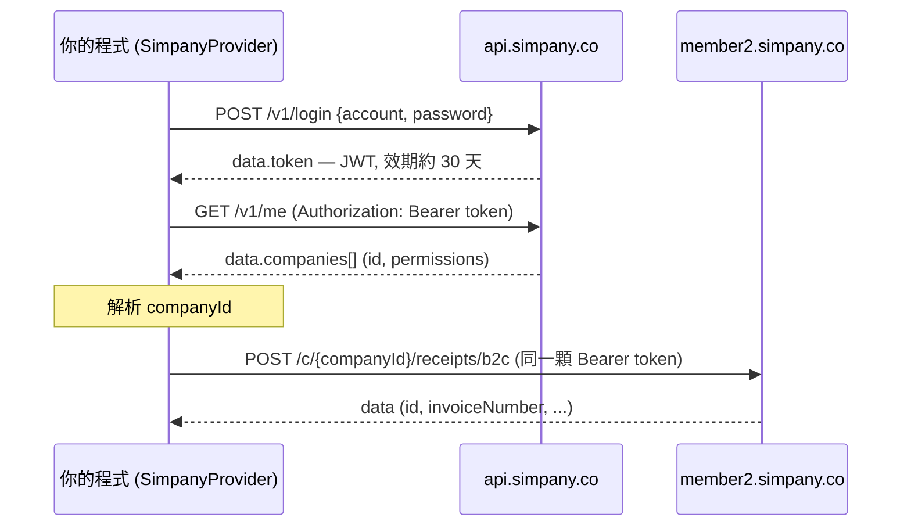

# @paid-tw/einvoice-simpany

Simpany（[simpany.co](https://simpany.co/e-invoice)）的 [@paid-tw/einvoice](../einvoice) 供應商轉接器。

> ⚠️ **五個操作的細節由我們人工梳理整理,可能有誤,尚未對過真實 API。**
> 登入 / `me` / 公司解析這層已對過正式 API（VERIFIED）；但開立、作廢、折讓、折讓作廢、
> 查詢的端點、payload、欄位名稱是人工整理出來的,**還沒用「已開通電子發票的帳號」實際
> 驗證過**。請當成 best-effort 起點使用,遇到不符就發 GitHub issue。本套件標記
> `private: true`,驗證通過前不會發佈到 npm。
>
> 使用前**請務必詳閱下方[免責聲明](#免責聲明)**,並自行確認符合相關法規與 Simpany 服務條款。

> 圖例:✅ = 已對過正式 API(VERIFIED);⚠️ = 人工整理、尚未實測(UNVERIFIED)。

## 架構與運作機制

- 本套件實作 core 的 `InvoiceProvider` 契約(`@paid-tw/einvoice`)。應用端只依賴該介面,
  換供應商就只換 constructor(`createSimpanyProvider(...)`),其餘程式不動。
- Simpany 沒有公開的開發者 API;以下形狀為人工整理(可能有誤)。
- **雙 host、同一顆 JWT**:
  - 認證 / 帳號:`https://api.simpany.co/v1`(`POST /login`、`GET /me`)— ✅ 已驗證
  - 電子發票(內部稱 **receipt**):`https://member2.simpany.co/api/v1/c/{companyId}/…` — ⚠️ 待驗證
- **一次操作的資料流**(以開立為例):
  1. 惰性登入取得 JWT(或使用注入的 `token`)
  2. 解析 `companyId`(由 config 指定,或 `GET /me` 取得)
  3. 對 receipt host 打 `POST /c/{companyId}/receipts/{b2b|b2c}`,並帶 `Authorization: Bearer <token>`



## 身份驗證(Authentication)

- **帳密換 token**:`POST https://api.simpany.co/v1/login`,body `{ account, password }`
  (`account` 為 member 的 email)→ 回 `{ status:"ok", data:{ id, token } }`。
- **token 是 JWT bearer**,效期約 **30 天**(`exp − iat = 2,592,000` 秒)。之後每個請求都帶
  HTTP header `Authorization: Bearer <token>`。
- **同一顆 token 同時授權兩個 host**(已交叉驗證):認證 host 與發票 host 共用。
- **client 行為**:惰性登入(首次呼叫才登入)→ 快取 token → 遇 `401` 自動重新登入一次並重試
  (需 config 有 `password`)。
- **可直接注入 token**:設定 `token` 即可略過帳密登入(例如從 vault 取),此時可不帶
  `account` / `password`。
- 登入**無 captcha / CSRF / MFA**;帳密僅經 TLS 傳給 `/login`。
- ⚠️ **安全**:token 等同一組效期 30 天的長期憑證——請只放在伺服器端,勿寫入前端或版控;
  帳密與 token 都應以環境變數 / secret 管理。追蹤日誌**不會記錄 request/response body**(見「錯誤處理與除錯」)。

**用 curl 手動取 token / 檢查權限:**

```bash
# 1) 帳密換 token
curl -s https://api.simpany.co/v1/login \
  -H 'content-type: application/json' \
  -d '{"account":"user@example.com","password":"••••••"}'
# → {"status":"ok","code":200,"data":{"id":5129,"token":"<JWT>"}}

# 2) 用 token 查帳號與名下公司(確認 permissions 是否含 e_receipt)
curl -s https://api.simpany.co/v1/me -H 'authorization: Bearer <JWT>'
```

**`GET /v1/me` 回應範例**(程式端對應 `client.ts` 匯出的 `SimpanyMe` / `SimpanyCompany` 型別;以下為示意假資料):

```jsonc
{
  "status": "ok",
  "code": 200,
  "data": {
    "id": 5129,
    "name": "王小明",
    "email": "user@example.com",
    "companies": [
      {
        "id": 3432,                       // ← 這就是 companyId
        "name": "範例股份有限公司",
        "service_type": "REGISTRATION_BOOKKEEPING",
        "operating_status": "OPERATING",
        "permissions": ["account_book", "e_receipt"]  // ← 需含 e_receipt 才能開發票
      }
    ]
  }
}
```

## 操作與端點（人工整理,UNVERIFIED）

| 統一操作 | HTTP | 端點（receipt base 之下） |
|---|---|---|
| 開立 `issue` | POST | `/c/{cid}/receipts/{b2b\|b2c}` |
| 作廢 `void` | DELETE | `/c/{cid}/receipts/{receiptId}`,body `{reason, emails}` |
| 折讓 `allowance` | POST | `/c/{cid}/receipts/{receiptId}/draft-allowances`,body `{emails, items:[{id,quantity,price}]}` |
| 折讓作廢 `voidAllowance` | DELETE | `/c/{cid}/allowances/{id}`(或 `/draft-allowances/{id}`) |
| 查詢 `query` | GET | `/c/{cid}/receipts/{receiptId}` |

- **內部 id vs 發票號碼**:作廢 / 查詢 / 折讓是用 Simpany 的**內部 receipt id**,不是發票號碼。
  請把 `issue` 結果的 `raw.id` 透過 `providerOptions.receiptId` 傳回來(最可靠);只給發票號碼
  時會嘗試用列表的 `keyword` 查詢反查——但那個查詢參數尚未驗證。
- **折讓作廢**必須帶 `providerOptions.allowanceId`(內部 id);若折讓還在「待確認(DRAFT)」
  狀態,加 `providerOptions.draft: true` 走 draft 端點。
- **能力**:宣告 ISSUE / VOID / ALLOWANCE / VOID_ALLOWANCE / QUERY / B2B。**不支援**
  MIXED_TAX(稅別為發票層級)、FOREIGN_CURRENCY、CARRIER_VALIDATION(前端無此端點)。

## 開立欄位對照與必填規則

`POST /c/{cid}/receipts/{b2b|b2c}`(依買方有無統編決定 b2b/b2c)。下表的必填 / 格式來自
開立表單的前端驗證,**伺服器端合約尚未驗證**;adapter 會在送出前做同樣的本地檢查
(可用 `validatePayload: false` 關閉)。

| wire 欄位 | 中文 | 必填 | 規則 / 值 | unified 對應 |
|---|---|---|---|---|
| `customId` | 自訂單號 | 選填 | 任意字串 | `orderId` |
| `customer.vat` | 買方統編 | B2B 必填 | 8 碼 | `buyer.ubn` |
| `customer.name` | 買受人名稱 | B2B 必填 | ≤255 | `buyer.name` |
| `customer.address` | 買方地址 | 選填 | — | `buyer.address` |
| `customer.emails` | 通知信箱 | **必填** | email(可多組) | `buyer.email` |
| `taxType` | 課稅別 | 必填 | `TAXABLE` / `ZERO_TAX_RATE` / `EXEMPTION` | `taxType` |
| `isTaxIncluded` | 含稅價 | 必填 | boolean | `priceMode` |
| `items[].name` | 品名 | 必填 | ≤255 | `item.description` |
| `items[].quantity` | 數量 | 必填 | 1–999999 | `item.quantity` |
| `items[].price` | 單價 | 必填 | 0–99999999 | `item.unitPrice` |
| `items[].subTotal` | 小計 | 必填 | =數量×單價 | `item.amount` |
| `carrier.type` | 載具類別 | B2C 必填 | `NO_CARRIER`/`MOBILE_BARCODE`/`CITIZEN_DIGITAL_CERTIFICATE`/`MEMBERSHIP` | `carrier.type` |
| `carrier.number` | 載具號碼 | 視載具 | 手機條碼 `/`+7 碼;自然人憑證 16 碼(2 英+14 數) | `carrier.code` |
| `npoBan` | 捐贈碼 | B2C+捐贈時必填 | 3–7 碼 | `donation.npoban` |
| `zeroTaxRateReasonCode` | 零稅率原因 | 零稅率必填 | 代碼(見 `zero-tax-rate-reasons`) | `providerOptions` |
| `customsClearanceType` | 通關方式 | 零稅率必填 | `NOT_VIA_CUSTOMS` / `VIA_CUSTOMS` | `providerOptions` |
| `remark` | 備註 | 選填 | — | `remark` |
| `shouldAdjustTaxAmount` | 稅額調整 | 選填 | boolean(B2B ±1) | `providerOptions` |

> 注意:表單**不提供指定開立日期**(由伺服器當下開立),故 unified 的 `date` 對 Simpany 無效。

### 金額語意

- Simpany 的**稅額與含稅/未稅計算在伺服器端完成**:你送 `items`(單價 `price` × 數量)與
  `isTaxIncluded`(由 unified 的 `priceMode` 決定 `TAX_INCLUSIVE` / `TAX_EXCLUSIVE`),伺服器據此
  算稅並產生法定金額。
- unified 的 `amount`(`salesAmount` / `taxAmount` / `totalAmount`,**整數 TWD**)在本 adapter 主要供
  **輸入驗證與結果回填**,不會逐欄送給 Simpany(伺服器以 `items` 為準)。
- 台灣法定金額為整數 TWD;本 adapter **不支援外幣**(未宣告 `FOREIGN_CURRENCY`)。

## 用法

```ts
import { createSimpanyProvider } from "@paid-tw/einvoice-simpany";

const provider = createSimpanyProvider({
  account: process.env.SIMPANY_ACCOUNT!,
  password: process.env.SIMPANY_PASSWORD!,
  // companyId: 3432,        // 指定公司；省略則由 /me 解析(唯一公司或以 companyUbn 挑選)
});

// 開立(B2C,依 buyer.ubn 自動判斷 B2B/B2C)
const inv = await provider.issue({
  orderId: "ORD-1",
  buyer: { name: "買受人", email: "buyer@example.com" },
  items: [{ description: "商品A", quantity: 2, unitPrice: 50, amount: 100 }],
  amount: { salesAmount: 100, taxAmount: 5, totalAmount: 105 },
  taxType: "TAXABLE",
  priceMode: "TAX_EXCLUSIVE",
});

// 後續操作把 raw.id 傳回來當 receiptId
const receiptId = (inv.raw as { id: number }).id;
await provider.query({ invoiceNumber: inv.invoiceNumber, providerOptions: { receiptId } });
await provider.void({ invoiceNumber: inv.invoiceNumber, reason: "開錯", providerOptions: { receiptId } });
```

`providerOptions` 可帶的欄位:`receiptId`、`allowanceId`、`draft`、`emails`(通知信收件人)、
`zeroTaxRateReasonCode` / `customsClearanceType`(零稅率用)、`shouldAdjustTaxAmount`(B2B ±1 稅額調整)、
`items`(直接指定折讓品項 `[{id,quantity,price}]`)。

## 設定(SimpanyConfig)

| 欄位 | 必填 | 說明 |
|---|---|---|
| `account` | 二擇一 | 登入帳號(member email)。與 `token` 二擇一 |
| `password` | 二擇一 | 登入密碼(僅走 TLS)。與 `token` 二擇一;有 `password` 才能在 401 時自動重登 |
| `token` | 二擇一 | 預先取得的 JWT,略過帳密登入 |
| `companyId` | 選填 | 指定公司範圍;省略則由 `GET /me` 解析 |
| `companyUbn` | 選填 | 多家公司時以統編挑選 |
| `validatePayload` | 選填 | 預設 `true`;送出前做本地驗證(設 `false` 關閉) |
| `timeoutMs` | 選填 | 單一請求逾時(毫秒) |
| `baseUrl` | 選填 | 覆寫認證 host base(預設 `https://api.simpany.co/v1`) |
| `receiptBaseUrl` | 選填 | 覆寫發票 host base(預設 `https://member2.simpany.co/api/v1`) |
| `debug` | 選填 | 追蹤回呼(metadata-only,見下) |
| `fetch` | 選填 | 注入自訂 `fetch`(測試 / edge runtime) |

## 錯誤處理與除錯

- **所有失敗都會 throw core 的 `InvoiceError`**(不會拋出原始錯誤),帶:
  - `code`:`AUTH` / `VALIDATION` / `NOT_FOUND` / `CONFLICT` / `NETWORK` / `PROVIDER` / `UNSUPPORTED` / `UNKNOWN`
  - `rawCode`、`rawMessage`、`raw`(原始回應,供除錯)
  - 判斷型別請用 `isInvoiceError(e)`,**不要用 `instanceof`**(跨 ESM/CJS 或版本不一致時 `instanceof` 會失準)。
- **對應規則**:HTTP `401`/`403`→`AUTH`、`404`→`NOT_FOUND`、`409`→`CONFLICT`、`400`/`422`→`VALIDATION`、
  `429` 與 `5xx`→`PROVIDER`;傳輸失敗→`NETWORK`。member2 的兩種錯誤格式(框架式 `{message}` / `{errors}`、
  業務式 `{status:"error",error:{title}}`)都已正規化。
- **除錯 / 追蹤**:設定 `debug` 回呼可收到每個 HTTP 呼叫的 metadata(`provider` / `method` / `url` /
  `status` / `durationMs` / `error`);**不會記錄 request / response body**(可能含個資或加密內容)。
  需要看 body 時,請自行包一層 `fetch` 由 `config.fetch` 傳入。

## 已交叉驗證(以自有帳號做唯讀查詢確認,未開立任何發票)

- ✅ 認證與電子發票**共用同一顆 JWT**:以 `api.simpany.co` 取得的 token 打
  `member2.simpany.co` 會進到應用層(而非被擋在 401)。
- ✅ base URL 與 `/c/{companyId}/receipts…` 路由結構正確(路由有 match)。
- ✅ 錯誤 envelope 為框架式 `{ message }`(必要時帶 `{ errors }`);未開通電子發票的公司
  對這些端點會回 **404**(adapter 會正規化成 `NOT_FOUND`)。

## 取得「已開通電子發票」的帳號

發票端點需要公司已在 Simpany **開通電子發票(加值中心)服務**。未開通時:

- `GET /v1/me` 的 `permissions` **不會含 `e_receipt`**;
- 對 `/c/{companyId}/receipts…` 一律回 **404**(adapter → `NOT_FOUND`)。

申請 / 開通請洽 Simpany 電子發票服務([simpany.co/e-invoice](https://simpany.co/e-invoice))。
開通後以同一組帳號登入即可操作(不需另建帳號)。

## 如何驗證串接是否正確(唯讀,不會開發票)

有了「已開通電子發票」的帳號後,用下列**唯讀**呼叫即可確認整條(認證 → 公司 → 權限 → 路由 →
回應解析)串對——**完全不會產生任何發票**:

```ts
const provider = createSimpanyProvider({ account, password });

// 1) 帳號 / 公司 / 權限(permissions 應含 e_receipt)
const me = await provider.me();
console.log(me.companies.map((c) => ({ id: c.id, permissions: c.permissions })));

// 2) 字軌:總量 / 已開立 / 剩餘
const tracks = await provider.listTrackNumbers();
console.table(
  tracks.map((t) => ({ period: t.period, total: t.total, used: t.used, remaining: t.remaining })),
);

// 3) 已開立發票列表(確認可讀取)
const receipts = await provider.listReceipts({ limit: 5 });
console.log(`可讀到 ${receipts.length} 張發票`);
```

- `me()` / `listTrackNumbers()` / `listReceipts()` 是本 adapter 的**擴充方法**(超出 `InvoiceProvider`
  介面),專供讀取 / 驗證,不會異動任何資料。
- 若帳號**尚未開通電子發票**,這些呼叫會回 404(→ `NOT_FOUND`)——那是權限 / 開通問題,不是串接錯誤。
- `listTrackNumbers()` 的 `total` / `used` / `remaining` 由 `beginNumber` / `endNumber` /
  `lastUsedNumber` / `quantity` 計算(欄位屬人工整理);每筆也帶原始 `raw`。**若數字對不上,請發 issue
  並附上 `raw`。**

## 待驗證清單(需「已開通電子發票」的帳號;接手的人請優先確認,對不上就發 issue)

1. 開立 payload 的欄位名與必填(尤其 `customer`、`carrier`、`zeroTaxRateReasonCode`)。
2. 開立/折讓**回應**的欄位名(`invoiceNumber`、`randomNumber`、`issuedAt`、`allowanceNumber`、`id`)。
3. 以發票號碼反查 receiptId 的列表查詢參數(目前假設 `keyword=`)。
4. **成功** envelope(目前假設 `{data}`)與開立的**業務錯誤**格式(假設 `{status:"error",error:{title}}`)。
5. 折讓確認流程(建立後為 DRAFT,是否需要額外「確認」步驟才生效)。

## 測試

```bash
pnpm --filter @paid-tw/einvoice-simpany exec vitest run

# Live(僅驗證登入層,打正式環境):
SIMPANY_LIVE=1 SIMPANY_ACCOUNT=… SIMPANY_PASSWORD=… \
  pnpm exec vitest run packages/einvoice-simpany/src/__tests__/live
```

## 貢獻(Contributing)

本 adapter 的發票操作是人工整理、尚未實測——**最有價值的貢獻,就是用「已開通電子發票的帳號」
實測並回報**。

- **回報不符(開 issue)**:對照上方「待驗證清單」逐項確認,並附上(⚠️ **務必先遮蔽 token /
  email / 統編 / 買受人等敏感資料**):
  1. 操作(`issue` / `void` / `allowance` / …)與你傳入的 unified 輸入;
  2. adapter 實際送出的 request(端點 + body)與 Simpany 的 response;
  3. 預期 vs 實際結果。
- **送修正(PR)**:確認某項後,請一併:
  1. 更新對應的 `endpoints.ts` / `provider.ts` / `mapping.ts`;
  2. 把該項從「待驗證清單」移到「已交叉驗證」,並移除對應的 UNVERIFIED / 「人工整理」字樣;
  3. 以(遮蔽後的)真實封包更新或新增 MSW 測試(`src/__tests__/`),讓測試反映實際格式;
  4. 送出前跑過完整閘門:
     `pnpm build && pnpm typecheck && pnpm lint && pnpm format:check && pnpm test`。
- **Live 測試**:`src/__tests__/live.test.ts` 目前只涵蓋登入層(`SIMPANY_LIVE=1`)。歡迎補上有權限
  帳號的開立/作廢/折讓 live 測試——注意這會產生**真實發票**,請使用測試模式 / 測試帳號。
- 驗證通過、操作穩定後,即可移除 `package.json` 的 `private: true` 對外發佈。

## 免責聲明

本套件依現狀（as-is）提供。使用前請務必自行確認你的使用方式符合相關法規、電子發票 /
稅務規範,以及 Simpany 的服務條款;並確認你的帳號與使用情境允許以程式方式存取。相關責任
由使用者自行承擔。
